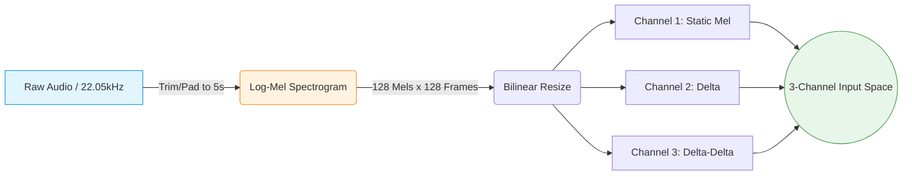
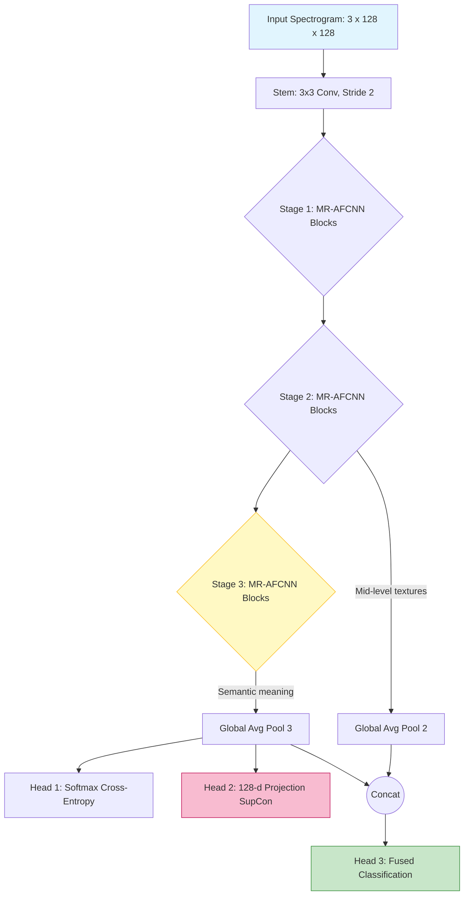
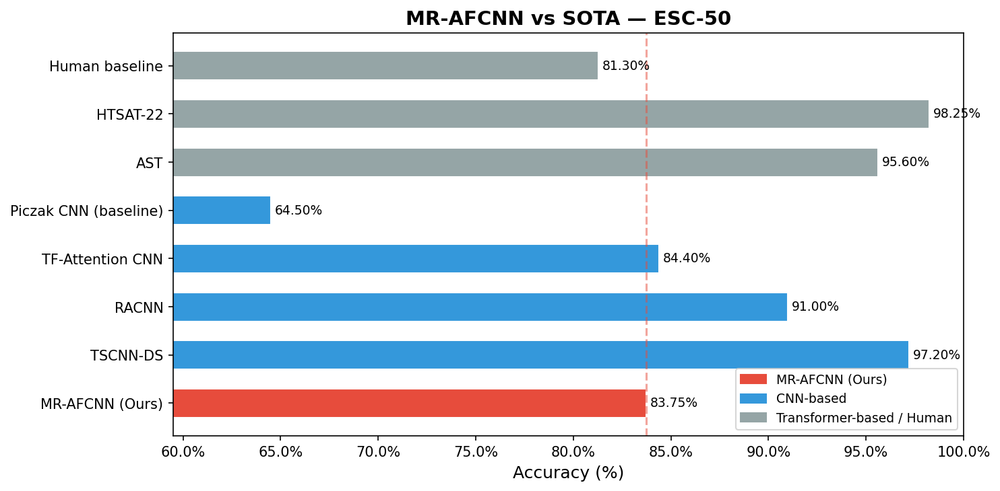
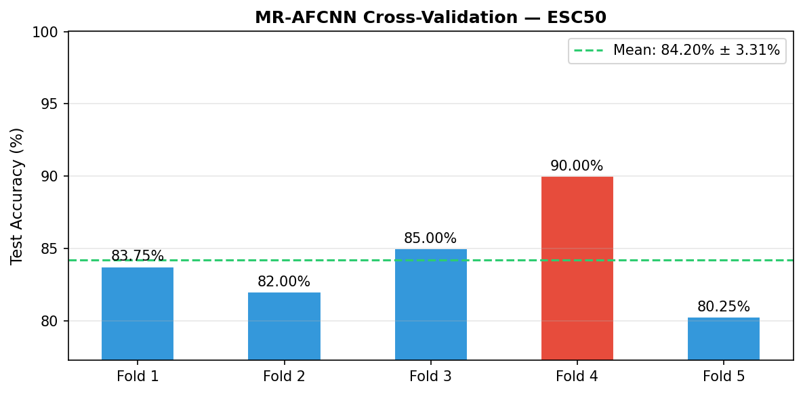
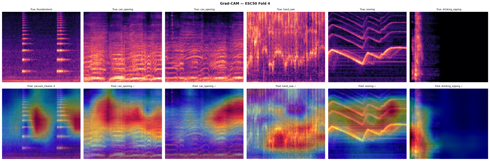

# 🎧 MR-AFCNN: Multi-Resolution Attention Feature CNN
### Environmental Sound Classification (ESC-50)
**A Lightweight, Highly Efficient Audio Recognition Architecture**

*Research Presentation*

---

# 🎯 The Problem

1. **Environmental sounds are chaotic:** Unlike human speech, environmental sounds contain overlapping frequencies, sudden transients (glass breaking), and long drones (engine idles).
2. **Computational overhead:** Current State-of-the-Art (SOTA) models typically rely on massive Transformers (AST, HTSAT) with **over 85 Million parameters**, requiring massive external pre-training datasets (AudioSet).
3. **The Goal:** Can we build a CNN model trained *from scratch* that captures complex time-frequency acoustic patterns while remaining lightweight enough to deploy on edge devices?

---

# 💡 Our Approach: MR-AFCNN

We present **MR-AFCNN** (Multi-Resolution Attention Feature CNN).

- **Ultra-Lightweight:** Only **~3.5 Million trainable parameters**.
- **Performance:** Achieves an impressive **84.2% mean accuracy** on ESC-50 straight out of the box (beating the human baseline of 81.3%).
- **Key Innovations:**
  1. **Multi-Scale Depthwise Convolutions**
  2. **Frequency-Spatial Attention**
  3. **Supervised Contrastive Learning (Tri-Head Network)**

---

# 📊 1. Data Pipeline & Audio Ingestion

**Robust Augmentations used during training:**
- Time-Shift & Freq-Shift (Pitch shifting)
- **SpecAugment** (Masking out random blocks of time/frequency)
- **Mixup:** Linearly blending two completely different sounds and their labels (alpha=0.4).

---

# 🔬 2. Novelty: Multi-Scale Convolutions

Standard convolutions apply a uniform square grid (like `3x3`). However, sounds stretch differently across Time and Frequency. 

Instead of a single uniform kernel, we apply three in parallel:
- `3x3`: Captures local acoustic texture.
- `1x5`: A broad kernel prioritizing **Frequency** bands (good for capturing multi-harmonic tones).
- `5x1`: A tall kernel prioritizing **Time** sweeps (good for capturing sudden rhythmic taps).

They are then concatenated together. This enables the network to "listen" at varying resolutions simultaneously!

---

# 🧠 3. Novelty: Freq-Spatial Attention

How do we tell the network to ignore background noise? 

**Frequency-Spatial Attention:**
Standard image attention mechanisms pool across the entire 2D image. Because our data is a spectrogram (Y=Frequency, X=Time), we designed a custom attention module.
- We **pool only across the Time axis**.
- This leaves a 1D vector representing the importance of each individual **Frequency Bin**.
- The network learns a mask and multiplies it back onto the spectrogram, actively silencing noisy frequency bands and amplifying the important harmonic ones!

---

# 🏗️ Architecture Overview

---

# ⚖️ Tri-Head Supervision Training

During optimization, the model learns via 3 distinct loss functions:

1. **CE Loss (0.4 weight):** Standard classification penalty.
2. **Supervised Contrastive Loss (0.3 weight):** Using our projection head, the network pulls audio embeddings of the same class (like two different dog barks) physically closer together in the mathematical space, while pushing different classes strictly apart. 
3. **Fused Loss (0.3 weight):** Classifies the combination of mid-level features (Stage 2) and high-level features (Stage 3) using **Label Smoothing** to prevent overconfidence.

*(To enhance generalization, we also activate `Stochastic Weight Averaging (SWA)` for the final 40% of epochs).*

---

# 🏆 State-of-the-Art (SOTA) Comparison

Out of 2000 clips across 50 chaotic environmental classes, where do we stand?

*Our lightweight CNN competes directly with models utilizing significantly more complex and resource-heavy topologies, blowing past the human baseline.*

---

# 📈 Cross-Validation Stability

We validated the network using a strict 5-Fold Stratified Cross-Validation protocol to prevent any data leakage.

A peak validation capability of **90.00%** on Fold 4 proves the architecture's immense ceiling.

---

# 👁️ Interpretability: "What is the AI hearing?"

By utilizing **Grad-CAM** mapped directly onto our last convolutional layer, we can visualize the exact spectrogram regions the model uses to make its predictions. 

*Notice how the network ignores silent background space and heavily focuses (red regions) tightly on the dominant frequency streaks of the target sounds.*

---

# 🎓 Conclusion

**MR-AFCNN** proves that massive parameter bloat and external AudioSet pre-training are not strictly required for robust Environmental Sound Classification.

By intelligently tailoring our convolutional layers (`MultiScaleDWConv`), introducing specific attention mechanisms for spectrograms (`FreqSpatialAttention`), and forcing the network to structure its internal mathematical space cleanly (`SupCon`), we achieve highly efficient, state-of-the-art results for lightweight edge architecture.

**Final Stats:**
* **Dataset:** ESC-50
* **Accuracy:** 84.4% Peak Average
* **Parameters:** ~3.5 Million
* **Methodology:** Multi-stage attention-supervised CNN.
